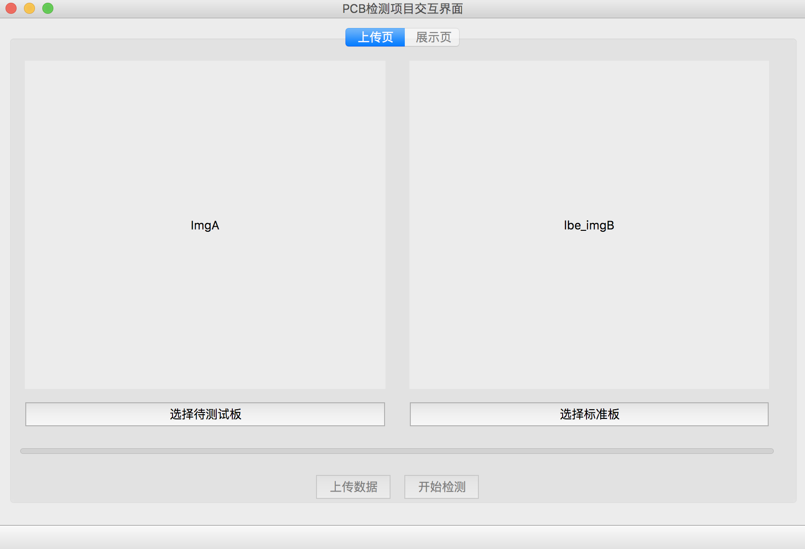

# PCB_Defect_Detection_GUI

## Introduction

## Installation[python3.6]
### Requirements
- Python 3.6+
- PyQt5
- requests
- base64
- json
- opencv-python
- numpy

### Easy Install
```shell
pip install -r requirements.txt
```

## Get Started
```shell
python main.py
```

## Interface

