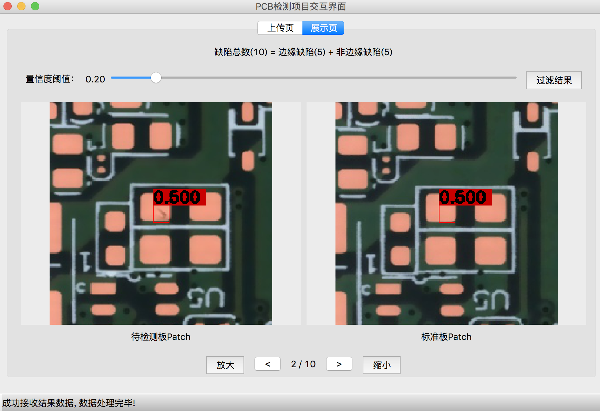

# PCB_Defect_Detection_GUI
## Introduction
None

## Installation[python3.6]
### Requirements
- Python 3.6+
- PyQt5
- requests
- base64
- json
- opencv-python
- numpy

### Easy Install
```shell
pip install -r requirements.txt
```

## Get Started
```shell
python main.py
```

## Interface
- Step 1.Select test board and standard board.

- Step 2.Upload image to server.

- Step 3.Send detection signal.

- Step 4.Select the display page.Set the threshold and observe the results.

